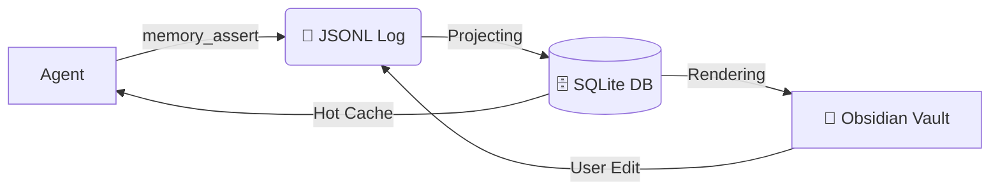

# 🧠 Pebble

[](https://opensource.org/licenses/MIT)
[](https://bun.sh)
[](https://modelcontextprotocol.io)

**Pebble is a local-first, append-only memory substrate for AI coding agents.**

Stop losing your agent's context. Pebble provides a durable, research-backed memory layer that injects a "hot cache" of relevant facts, skills, and preferences into every session.

### 🔬 Research-Backed
Pebble isn't a simple file-syncer. It's built on a "known-good" architecture derived from the 2026 agentic memory research wave:
*   **EverMemOS** (`2601.02163`) — MemCell schema & atomic fact extraction.
*   **AutoSkill** (`2603.01145`) — Automated skill extraction from user queries.
*   **SwiftMem** (`2601.08160`) — Query-aware indexing and context caching.

Four packages live here:

| Package | What it is |
| --- | --- |
| [`pebble-mcp/`](./pebble-mcp) | The core: MCP server + SQLite projection + markdown renderers + CLI |
| [`claude-code-plugin/`](./claude-code-plugin) | Claude Code plugin: slash commands, hooks, skills, reviewer subagent |
| [`factory-droid-plugin/`](./factory-droid-plugin) | Factory Droid plugin: commands, hooks, skills, reviewer droid |
| [`gemini-cli-plugin/`](./gemini-cli-plugin) | Gemini CLI extension: TOML commands, hooks, skills, reviewer sub-agent |

Current status: MVP tagged `pebble-mvp-v0.0.1`. Live memory for the author is at `~/.pebble/` (12 cells, 12 events, 28 facts as of this writing).

## 🧠 How it Works



### ⚔️ Why Pebble? (vs. Claude Obsidian)
Most memory tools focus on **file synchronization**. Pebble focuses on **state management**.

| Feature | Pebble | Claude Obsidian |
| --- | --- | --- |
| **Architecture** | Append-only Event Log | Simple File Sync |
| **Performance** | SQLite + FTS5 Indexing | Brittle File Watching |
| **Integrations** | MCP, Claude Code, Gemini CLI | Claude Desktop Only |
| **Research** | Based on EverMemOS | N/A |

1. **Log** (`~/.pebble/log.jsonl`) — every assertion, retraction, skill write, profile update is a single JSONL line. Never rewritten.
2. **Projection** (`~/.pebble/projection.db`) — SQLite view of the log: `cells`, `facts`, `scenes`, `skills`, `foresight`, `events`, plus an FTS5 index.
3. **Vault** (`~/.pebble/vault/*.md`) — human-readable markdown rendered from the projection: `profile.md`, `skills/*.md`, `scenes/*.md`, `_foresight.md`, `_contradictions.md`, `_index.md`.
4. **Hot cache** — at session start each plugin injects a compact block (profile + active skills + current foresight + recent cells) so the agent begins every conversation already-oriented.
5. **Reviewer loop** — after every assistant turn, a `Stop` hook fires and a lightweight reviewer extracts new preferences/projects/profile updates and calls `memory_assert` to persist them. No manual curation required.

## 🚀 Quickstart

```bash
# 1) core
cd pebble-mcp
bun install
bun run init          # creates ~/.pebble/{log.jsonl,projection.db,vault,trace.jsonl}
bun link              # installs `pebble-mcp` on PATH
bun test              # 78 tests

# 2) Claude Code
claude plugins marketplace add /absolute/path/to/pebble/claude-code-plugin
claude plugins install pebble@pebble-local

# 3) Factory Droid
# Edit ~/.factory/plugins/known_marketplaces.json + installed_plugins.json to point at
# factory-droid-plugin/, enable the plugin in ~/.factory/settings.json, and add the MCP
# server entry to ~/.factory/mcp.json:
#   "pebble": { "command": "/ABS/PATH/TO/bun", "args": ["run", "/ABS/PATH/.../pebble-mcp/src/index.ts", "serve"] }

# 4) Gemini CLI
gemini extensions link /absolute/path/to/pebble/gemini-cli-plugin
# or from the repo root: `gemini extensions install /absolute/path/to/pebble/gemini-cli-plugin`
```

## 🛠️ CLI reference (pebble-mcp)

```
pebble-mcp serve                  # MCP stdio server (11 tools)
pebble-mcp init                   # create ~/.pebble structure
pebble-mcp verify                 # replay log → projection, confirm consistency
pebble-mcp status                 # counts: cells, events, skills
pebble-mcp hot-cache-for-cc       # system-prompt block (Claude Code format)
pebble-mcp hot-cache-for-droid    # system-prompt block (Droid format)
pebble-mcp hot-cache-for-gemini   # system-prompt block (Gemini CLI format)
pebble-mcp render-vault           # materialize full markdown vault
pebble-mcp commit-turn <arg>      # CC/Droid plugin hook helper
pebble-mcp review-turn <arg>      # extract facts from a transcript
pebble-mcp seed-test-fixture      # seed synthetic data (tests/demos)
```

## 🧩 MCP tools (exposed via `serve`)

| Tool | Purpose |
| --- | --- |
| `memory_assert` | Write a new MemCell (profile / preference / project / episodic / skill / transient) |
| `memory_query` | Hybrid BM25 + recency + confidence search over cells |
| `memory_touch` | Record a retrieval hit against a cell |
| `memory_retract` | Mark a cell retracted (append-only, still in log) |
| `memory_read_cell` | Read a single cell by id |
| `profile_read` | Dump the derived profile |
| `profile_update` | Merge new facts into profile |
| `skill_save` | Save a SKILL.md-compatible skill |
| `skill_list` | List saved skills |
| `skill_read` | Read a skill by name |
| `trace_read` | Retrieval-trace tail for observability |

## 📊 Visualizing your memory

Four paths, pick whichever fits your flow:

- **Dashboard** — run `pebble-mcp status` or query `~/.pebble/projection.db` directly for a live view.
- **Hot cache** — `pebble-mcp hot-cache-for-cc` / `...-droid` prints the exact block the plugins inject at session start.
- **Vault** — `pebble-mcp render-vault` materializes `~/.pebble/vault/{profile,_foresight,_contradictions,_index}.md` + `skills/*.md` + `scenes/*.md`. Open in Obsidian for a graph view, or any editor.
- **Log** — `tail -f ~/.pebble/log.jsonl` for the raw event stream.

## 📂 Layout

```
pebble/
├── README.md                     # this file
├── pebble-mcp/                   # core library + MCP server + CLI
│   ├── src/
│   │   ├── index.ts              # dispatcher
│   │   ├── server.ts             # MCP stdio server
│   │   ├── cli/                  # init, verify, status, hot-cache, render-vault, commit-turn, review-turn
│   │   ├── memory/               # cell/fact/scene types + storage
│   │   ├── projection/           # SQLite schema + projector
│   │   ├── render/               # profile/skill/scene/foresight/contradictions/index renderers
│   │   ├── hotcache/             # hot-cache builder (CC + Droid targets)
│   │   ├── review/               # deterministic MVP reviewer + transcript parser
│   │   └── paths.ts              # ~/.pebble layout
│   └── tests/                    # 78 tests across 18 files
├── claude-code-plugin/           # `pebble@pebble-local` for Claude Code
│   ├── plugin.json               # manifest + MCP server entry
│   ├── commands/                 # /pebble, /remember, /forget, /recall, /profile
│   ├── agents/                   # pebble-reviewer subagent
│   ├── skills/                   # pebble, pebble-query, pebble-save
│   └── hooks/                    # SessionStart, PostToolUse, PostCompact, Stop
├── factory-droid-plugin/         # pebble@pebble-local for Factory Droid
│   ├── plugin.json               # manifest (MCP in ~/.factory/mcp.json)
│   ├── commands/                 # /pebble, /remember, /forget, /recall, /profile
│   ├── droids/                   # pebble, pebble-reviewer
│   ├── skills/                   # pebble, pebble-query, pebble-save
│   └── hooks/                    # SessionStart, PostToolUse, Stop
└── gemini-cli-plugin/            # `pebble` extension for Gemini CLI
    ├── gemini-extension.json     # manifest + embedded MCP server
    ├── GEMINI.md                 # context file (loaded into system prompt)
    ├── commands/                 # *.toml — /pebble, /remember, /forget, /recall, /profile
    ├── agents/                   # pebble-reviewer sub-agent
    ├── skills/                   # pebble, pebble-query, pebble-save
    └── hooks/                    # SessionStart, AfterTool, AfterAgent, PreCompress
```

## 🎨 Design principles

- **Append-only log** — the JSONL file is the source of truth. Everything else is derived and can be rebuilt via `pebble-mcp verify`.
- **Markdown round-trip** — editing a vault `.md` file in Obsidian emits a `user_edit` event back into the log, so the user stays in the loop.
- **Two-way hydration** — session-start injection pulls *from* memory; the Stop-hook reviewer pushes new facts *into* memory. No manual `/remember` required, though the slash command exists for explicit writes.
- **Local-first** — every byte lives under `~/.pebble/`. No network, no remote store. Portable JSONL + SQLite.
- **Plugin-agnostic core** — `pebble-mcp` knows nothing about Claude Code or Droid; the plugins are thin wrappers.

## 🧪 Tests

```bash
cd pebble-mcp
bun test                 # 78 tests, 148 expect() calls
bun run typecheck        # tsc --noEmit
```

Each plugin also has a smoke test at `<plugin>/scripts/smoke.sh`.

## 🏷️ Tags

| Tag | What it ships |
| --- | --- |
| `pebble-mcp-mvp-v0.0.1` | Core library + MCP server + CLI |
| `pebble-cc-plugin-mvp-v0.0.1` | Claude Code plugin |
| `pebble-droid-plugin-mvp-v0.0.1` | Factory Droid plugin |
| `pebble-gemini-plugin-mvp-v0.0.1` | Gemini CLI extension |
| `pebble-mvp-v0.0.1` | Umbrella release |

## 📄 License

MIT License
